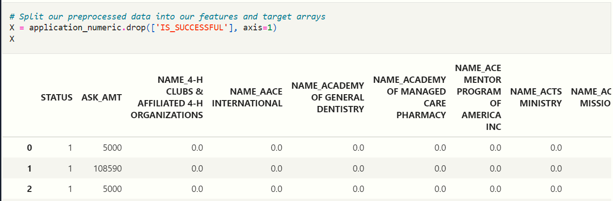
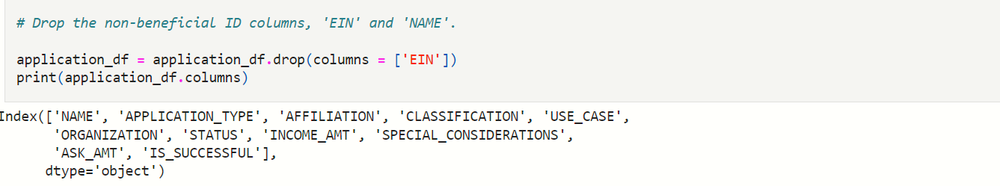
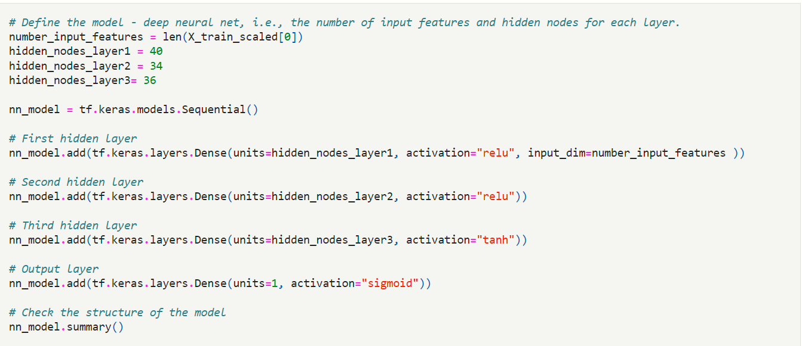
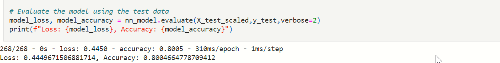
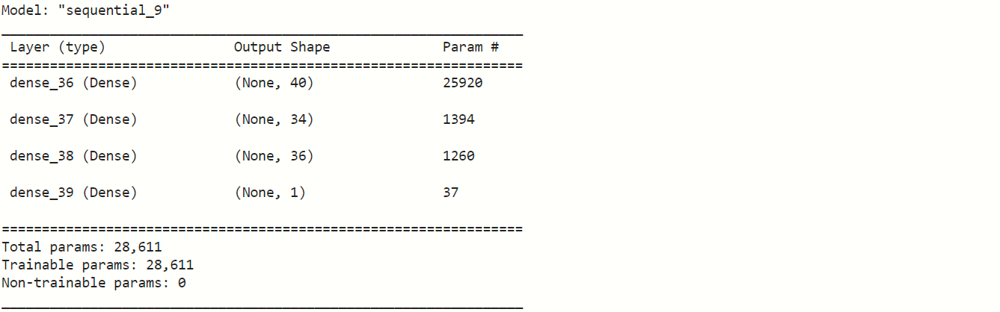
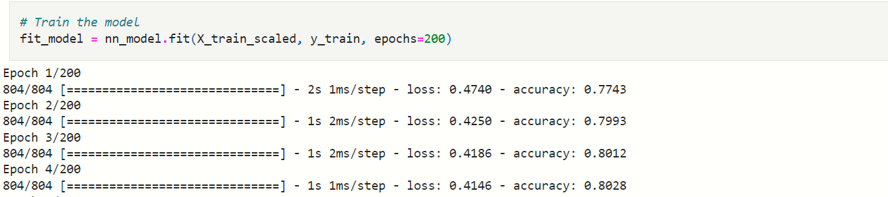

# Alphabet Soup Charity Funding Prediction

## Overview
This project is aimed to build a model that can  help  Alphabet Soup, a nonprofit foundation, to choose the most promising applicants for charity funding. You will use machine learning and neural networks to design a binary classificaier that can predict whether appliacants will be successful or not, based on a CSV dataset of more than 34,000 organizations that have received funding from Alphabet Soup during the past several years.

## Project outline
   The project is conducted in the following steps:
### Step 1: Preprocess and explore the Dataset using Pandas and scikit-learn
   * Read in the charity_data.csv to a Pandas DataFrame
   * Pick a cutoff point to bin "rare" categorical variables
   * Split the data into training and testing datasets.
   * Scale the training and testing features datasets by creating a StandardScaler instance
### Step 2: Compile, Train, and Evaluate the neural network Model using TensorFlow and Keras
   * Continue using the file in Google Colab in which you performed the preprocessing steps
   * Create a neural network model by assigning the number of input features and nodes for each     layer using TensorFlow and Keras
   * Create the several hidden layers and an output layer with an appropriate activation function.
   * Compile and train the model.
   * Evaluate the model using the test data to determine the loss and accuracy.
   * Save and export the results to an HDF5 file.
 ### Step 3: Optimize the Model
    The following methods are recommended to use: 
   * Dropping fewer columns.
   * Creating more bins for rare occurrences in columns.
   * Increasing or decreasing the number of values for each bin.
   * Add more neurons to a hidden layer.
   * Add more hidden layers.
   * Use different activation functions for the hidden layers.
   * Add or the number of epochs to the training regimen.
 ### Step 4: Write a Report on the Neural Network Model 

 ## Results and Analysis:
   * 	1.What variable(s) are the target(s) for your model?
      y ('IS_SUCCESSFUL') is the target variable in the model.
      
   * 	2.What variable(s) are the features for your model?
      All other input data except y ('IS_SUCCESSFUL')and dropped ID columns are the features for the model.
      
   *  3.What variable(s) should be removed from the input data because they are neither targets nor features?
      Two ID columns “EIN” and “NAME” are removed from the data set in the original model. But “NAME” column is added back later in order to improve the predicting accuracy of the model.
      
   *  4.How many neurons, layers, and activation functions did you select for your neural network model, and why?
      In the optimized model I selected 3 hidden layers with 40, 34, and 36 neurons respectively. The activation functions used in the first two hidden layers are ReLU and the activation function used in the third hidden layer is tanh. The output layer uses the sigmoid activation function. 
      
      The main purpose of the activation function is to introduce the property of nonlinearity into the model. ReLU  is the best deep learning nonlinear function , which does not have the vanishing gradient problem and is computationally inexpensive. The tanh activation function is also a nonlinear activation function that is similar to the sigmoid function.
      The more neurons and layers are chosen, the more params are trained, as a result the higher accuracy we are able to achieve. In  the final model the 28,611 trainable params are chosen and trained.
   *  5.Were you able to achieve the target model performance?
      Yes. The accuracy of optimized final model exceeded the target 75% and reached 80.05%, which means our model is able to predict the success of funding case effectively.
      
   *  6	What steps did you take in your attempts to increase model performance?
      The predictive accuracy of the model achieved 80.005% after applying the following methods to adjust the input data and optimize the model:
        - Reducing the number of dropped columns. ID column “NAME” is added back in the optimized model. Every specific organization has different executive ability, so investigation to the prior funding history of organizations is meaningful and important to estimate and increase the possibility of future success.
        - Creating more bins for columns with rare occurrences. The “NAME” variable is added back with small cut off value”3”. The cutoff points of bins of 'APPLICATION_TYPE'and 'CLASSIFICATION' were also setup as smaller value 50 and 10 respectively.
        - Adding more neurons, hidden layers and using different activation functions for the hidden layers.  In the optimized model 28,611 params are chosen and trained.
       
        - Increasing the number of epochs in the training regimen. Epochs is increased from default 100 to 200.
       

## Summary

To sum up, this project used python libraries Pandas and scikit-learn to process and explore a CSV dataset containing funding record of 34,000 organizations that have received funding over the years.  The neural network model is designed, trained, evaluated and optimized using deep learning libraries TensorFlow and Keras. After adjustment and optimization, the finalized model has achieved great performance with a model loss of ”0.4450” and model accuracy of “0.8005”, which exceeded the target accuracy of ”0.75” by a significant margin.

To solve the classification problem, some other recommended approach is to develop a single neural network model that can predict both a numeric and class label value from the same input, such as “OutputCodeClassifier”,“MultiOutputClassifier”, “ClassifierChain” and “OneVsRestClassifier”. These models can be used to solve multi-output classification problems where each sample has multiple target labels that are mutually exclusive.  

